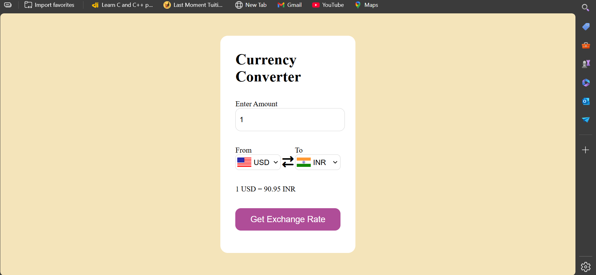
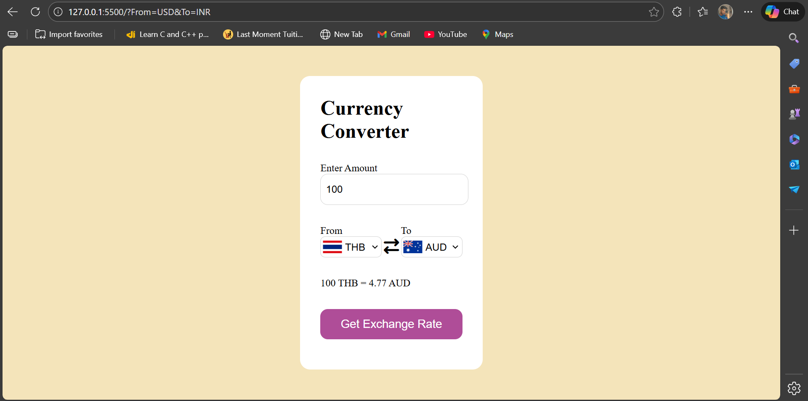
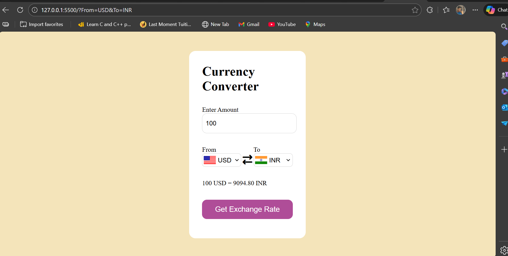

# 💱 Currency Converter Web App

A simple and responsive **Currency Converter** web application built using **HTML, CSS, and JavaScript**.  
The app fetches **real-time exchange rates** using a public currency API and dynamically updates conversion results without reloading the page.

---

## 🚀 Features

- 🌍 Supports **multiple world currencies**
- 🔄 Real-time exchange rate conversion
- 🏳️ Dynamic country flags based on selected currency
- ⚡ Uses **Fetch API** with `async/await`
- 🧠 Clean and beginner-friendly JavaScript logic
- 📱 Responsive UI

---

## 🛠️ Tech Stack

- **HTML5** – Structure
- **CSS3** – Styling & layout
- **JavaScript (ES6)** – Logic & API handling
- **Fetch API** – HTTP requests

---

## 📸 Screenshots

### 🔹 Home Page


### 🔹 Currency Selection


### 🔹 Conversion Result


---

## 📂 Project Structure

Currency-Converter/
│
├── index.html # Main HTML file
├── style.css # Styling
├── app.js # Application logic
├── codes.js # Currency & country mapping
└── assets/ # Screenshots

yaml
Copy code

---

## ⚙️ How It Works

1. User enters an amount
2. Selects **From** and **To** currencies
3. App fetches exchange rates from the API
4. Conversion is calculated and displayed instantly
5. Flags update dynamically based on currency

---

## 🌐 API Used

https://latest.currency-api.pages.dev/v1/currencies

yaml
Copy code

- Returns up-to-date exchange rates
- No authentication required
- Lightweight and fast

---

## ▶️ How to Run Locally

1. Clone the repository
   ```bash
   git clone https://github.com/Gaurav-Vennamwar/Currency-Converter.git
Open the project folder

Run using Live Server (recommended)


